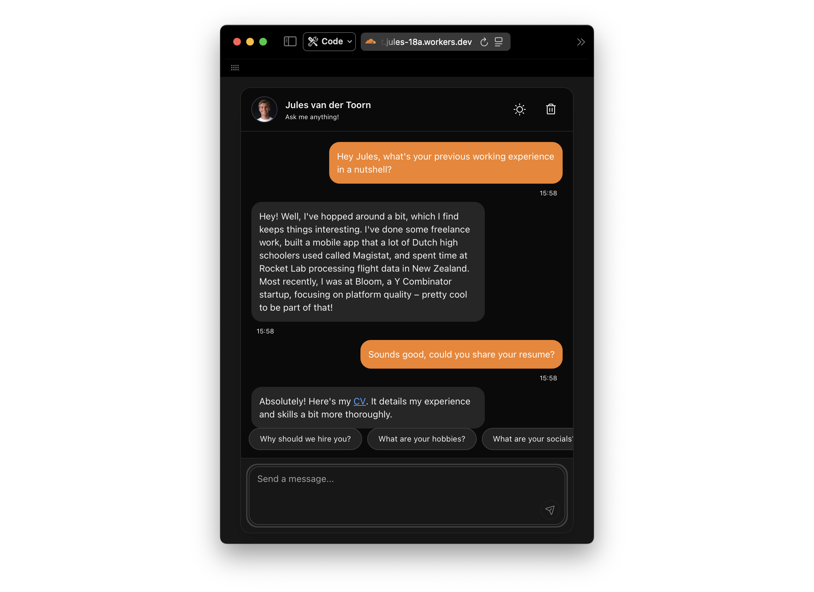

# Jules' Digital Twin Chat



**🚀 Try it out yourself: [cf-ai-jules-agent.jules-18a.workers.dev](https://cf-ai-jules-agent.jules-18a.workers.dev/)**

Ever wanted to chat with a candidate at 3 AM without waking them up? Now you can! This is my digital twin - an AI-powered chat agent that knows everything about me. Built specifically for Cloudflare recruiters to learn about my experience and skills.

Think of it as an interactive resume that actually responds to your questions. Want to know about my experience at Bloom? Ask away. Curious about my hobbies? Just chat. Need my actual resume? My digital twin can share that too!

## ✨ Features

- 💬 Natural conversation with an AI version of me
- 🧠 Powered by Google's Gemma 3 model
- ⚡️ Real-time streaming responses
- 💾 Persistent conversation history per browser session
- 🔒 Automatic chat cleanup after 7 days of inactivity
- 🌓 Dark/Light theme support (of course!)

## 🏗️ Tech Stack

This project is built entirely on Cloudflare's platform:

- **Cloudflare Workers** - Serves the web app and handles API requests
- **Cloudflare Durable Objects** - Stores conversation history with SQL
- **Cloudflare R2** - Stores documents (resume, cover letter, system prompt)
- **Cloudflare Workers AI** - Runs the Gemma 3 12B model
- **Vercel AI SDK** - Handles the AI streaming and tool calling
- **React + Vite** - Modern UI with Tailwind CSS

## 🚀 Quick Start

### Prerequisites

- Node.js 18+ installed
- A Cloudflare account
- Wrangler CLI (installed via npm below)

### Local Development

1. **Clone and install dependencies:**

```bash
npm install
```

2. **Prepare your documents:**

Create a `data/` directory in the project root with these files:

```
data/
├── system-prompt.txt    # Your personality and background info
├── resume.pdf          # Your resume
└── cover-letter.pdf    # Your cover letter
```

3. **Upload documents to R2:**

First, create the R2 bucket:

```bash
npx wrangler r2 bucket create documents
```

Then upload your documents:

```bash
npm run upload-docs
```

4. **Run locally:**

```bash
npm start
```

Visit `http://localhost:5173` to chat with your digital twin!

### Deployment

1. **Deploy to Cloudflare:**

```bash
npm run deploy
```

That's it! Your digital twin is now live on Cloudflare Workers.

2. **Custom domain (optional):**

Add a custom domain in the Cloudflare dashboard under Workers & Pages > Your Worker > Settings > Domains & Routes.

## 📁 Project Structure

```
├── src/
│   ├── app.tsx              # React chat UI
│   ├── server.ts            # Worker entry point and API handlers
│   ├── system-prompt.ts     # Loads system prompt from R2
│   ├── utils.ts             # Helper functions for message processing
│   └── components/          # Reusable UI components
├── scripts/
│   └── upload-documents.ts  # Script to upload docs to R2
├── data/                    # Your documents (gitignored)
└── public/                  # Static assets
```

## 🔧 How It Works

1. **Session Management**: Each visitor gets a unique session ID stored in a cookie
2. **Durable Objects**: Conversation history is stored per session in Cloudflare Durable Objects with SQLite
3. **R2 Storage**: Documents are fetched from R2 on-demand (system prompt is loaded on each request)
4. **Workers AI**: The Gemma 3 model runs on Cloudflare's inference network
5. **Auto-cleanup with Alarm Timers**: Conversations are automatically deleted after 7 days of inactivity using Durable Objects' alarm API. Each time a message is sent, the alarm is extended by 7 days. When the alarm fires (after 7 days of no activity), the conversation history is permanently deleted from storage. This results in automatic data cleanup for privacy without manual maintenance or cron jobs.
