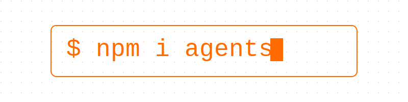

# 🤖 Personal AI Chatbot - Jules



> **Built for Cloudflare Summer Internship Application**

This is a personalized AI chatbot that represents Jules, built using Cloudflare's cutting-edge AI and edge computing technologies. It allows recruiters and hiring managers to learn about Jules' background, experience, and availability through natural conversation.

## 🎯 Project Overview

This chatbot demonstrates proficiency with:
- **Llama 3.3** on Workers AI (no external API keys!)
- **Vectorize** for semantic search over CV/cover letter
- **Durable Objects** for stateful per-user conversations
- **Cookie-based sessions** for frictionless anonymous authentication
- **RAG (Retrieval Augmented Generation)** for accurate information retrieval

## ✨ Features

- 💬 Interactive chat with Llama 3.3 AI model
- 🔍 Semantic search over personal documents (CV & cover letter)
- 🍪 Anonymous cookie-based sessions (no login required)
- 💾 Persistent conversation history per user
- 👤 Remembers user names across sessions
- 📄 Can provide document downloads (CV & cover letter)
- 🔒 Secure (HttpOnly, SameSite=Strict cookies)
- 🌓 Dark/Light theme support
- ⚡️ Real-time streaming responses

## 📚 Documentation

- **[IMPLEMENTATION.md](./IMPLEMENTATION.md)** - Detailed technical implementation guide
- **[setup-documents.md](./setup-documents.md)** - How to ingest your CV and cover letter
- **[my-documents.example.json](./my-documents.example.json)** - Template for your documents

## 🚀 Quick Start

### Prerequisites

- Cloudflare account
- Node.js 18+ installed

### 1. Install Dependencies

```bash
npm install
```

### 2. Create Vectorize Index

```bash
npx wrangler vectorize create personal-cv-index --dimensions=768 --metric=cosine
```

### 3. Set Up Your Documents

Copy the example template and fill in your information:

```bash
cp my-documents.example.json my-documents.json
# Edit my-documents.json with your actual CV and cover letter
```

### 4. Deploy

```bash
npm run deploy
```

### 5. Ingest Documents

```bash
# Get your worker URL from the deploy output, then:
curl -X POST https://your-worker.workers.dev/admin/ingest \
  -H "Content-Type: application/json" \
  -d @my-documents.json
```

### 6. Test Locally (Optional)

```bash
npm start
# Visit http://localhost:8787
```

## 🧪 Testing

Run the automated setup checker:

```bash
./test-setup.sh
```

Try these sample questions:
- "Hi, I'm Sarah from Cloudflare"
- "What experience does Jules have with Python?"
- "Tell me about Jules' education"
- "Can you send me your CV?"
- "When is Jules available for an internship?"

## 📁 Project Structure

```
├── src/
│   ├── server.ts           # Worker + Chat agent with session management
│   ├── tools.ts            # RAG, memory, and document tools
│   ├── ingest-documents.ts # Document embedding utilities
│   ├── app.tsx             # React UI with custom branding
│   ├── utils.ts            # Helper functions
│   └── styles.css          # UI styling
├── wrangler.jsonc          # Cloudflare config (Vectorize, Durable Objects, Cron)
├── IMPLEMENTATION.md       # Technical implementation details
├── setup-documents.md      # Document ingestion guide
├── my-documents.example.json # Template for CV/cover letter
└── test-setup.sh          # Automated setup verification
```

## Customization Guide

### Adding New Tools

Add new tools in `tools.ts` using the tool builder:

```ts
// Example of a tool that requires confirmation
const searchDatabase = tool({
  description: "Search the database for user records",
  parameters: z.object({
    query: z.string(),
    limit: z.number().optional()
  })
  // No execute function = requires confirmation
});

// Example of an auto-executing tool
const getCurrentTime = tool({
  description: "Get current server time",
  parameters: z.object({}),
  execute: async () => new Date().toISOString()
});

// Scheduling tool implementation
const scheduleTask = tool({
  description:
    "schedule a task to be executed at a later time. 'when' can be a date, a delay in seconds, or a cron pattern.",
  parameters: z.object({
    type: z.enum(["scheduled", "delayed", "cron"]),
    when: z.union([z.number(), z.string()]),
    payload: z.string()
  }),
  execute: async ({ type, when, payload }) => {
    // ... see the implementation in tools.ts
  }
});
```

To handle tool confirmations, add execution functions to the `executions` object:

```typescript
export const executions = {
  searchDatabase: async ({
    query,
    limit
  }: {
    query: string;
    limit?: number;
  }) => {
    // Implementation for when the tool is confirmed
    const results = await db.search(query, limit);
    return results;
  }
  // Add more execution handlers for other tools that require confirmation
};
```

Tools can be configured in two ways:

1. With an `execute` function for automatic execution
2. Without an `execute` function, requiring confirmation and using the `executions` object to handle the confirmed action. NOTE: The keys in `executions` should match `toolsRequiringConfirmation` in `app.tsx`.

## 🔧 Technical Details

### AI Model

This project uses **Llama 3.3** (`@cf/meta/llama-3.3-70b-instruct-fp8-fast`) running on Cloudflare Workers AI. No external API keys required!

### RAG System

The Retrieval Augmented Generation system uses:
1. **Workers AI embeddings** (`@cf/baai/bge-base-en-v1.5`) to convert text to vectors
2. **Vectorize** to store and search document embeddings
3. **Semantic search** to find relevant CV/cover letter chunks
4. **Llama 3.3** to synthesize natural responses from retrieved context

### Session Management

- Cryptographically secure session IDs via `crypto.getRandomValues()`
- HttpOnly, Secure, SameSite=Strict cookies
- Each session maps to a unique Durable Object instance
- 7-day cookie expiry with automatic renewal

### Privacy

- Per-user data isolation via Durable Objects
- No tracking or analytics beyond Cloudflare's platform
- Users can manually clear history at any time
- Conversations persist for continuous experience across sessions

### Modifying the UI

The chat interface is built with React and can be customized in `app.tsx`:

- Modify the theme colors in `styles.css`
- Add new UI components in the chat container
- Customize message rendering and tool confirmation dialogs
- Add new controls to the header

## 🎓 What I Learned

Building this project helped me master:

1. **Cloudflare's Edge Computing Platform**
   - Workers for serverless compute
   - Durable Objects for stateful applications
   - Vectorize for vector search
   - Workers AI for inference

2. **AI/ML Concepts**
   - RAG (Retrieval Augmented Generation)
   - Semantic search and embeddings
   - Vector databases
   - Prompt engineering

3. **Secure Web Development**
   - Cookie-based authentication
   - Security best practices (HttpOnly, SameSite, etc.)
   - Privacy-preserving design
   - Session management

4. **Full-Stack Development**
   - React with TypeScript
   - RESTful API design
   - Real-time streaming
   - State management

## 🚀 Future Enhancements

Potential improvements for this chatbot:

- [ ] PDF/DOCX generation for document downloads
- [ ] Voice chat integration
- [ ] Multi-language support
- [ ] Admin dashboard with analytics
- [ ] Interview scheduling integration
- [ ] More sophisticated RAG with re-ranking
- [ ] Conversation export functionality
- [ ] Integration with calendar APIs

## 📖 Learn More

- [Cloudflare Agents Documentation](https://developers.cloudflare.com/agents/)
- [Cloudflare Workers AI](https://developers.cloudflare.com/workers-ai/)
- [Vectorize Documentation](https://developers.cloudflare.com/vectorize/)
- [Durable Objects](https://developers.cloudflare.com/durable-objects/)
- [Workers Documentation](https://developers.cloudflare.com/workers/)

## 👤 About

This project was built by Jules as part of a Cloudflare Summer Internship application. It showcases:

- Proficiency with Cloudflare's AI and edge computing platform
- Full-stack development skills
- Understanding of modern web security practices
- Ability to quickly learn and implement with new technologies

Feel free to explore the code and chat with the bot!

## 📝 License

MIT

---

**Built with ❤️ using Cloudflare Workers, Durable Objects, Vectorize, and Workers AI**
